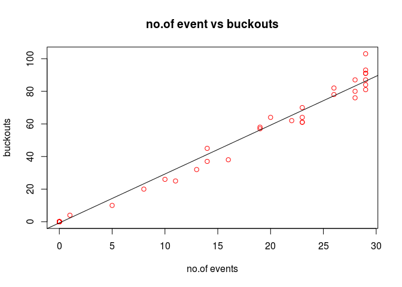

Bivariate Data
================

GitHub Documents
----------------

This is an R Markdown format used for publishing markdown documents to GitHub. When you click the **Knit** button all R code chunks are run and a markdown file (.md) suitable for publishing to GitHub is generated.

Including Code
--------------

``` r
bull<-read.csv("~/UTexasDA/BikeData/Bivariate/BullRiders.csv")

View(bull)
```

``` r
plot(bull$YearsPro,bull$BuckOuts14, xlab="years pro",ylab="buckouts", main="plot of years pro vs buckouts", col=c("red","green"))

plot(bull$YearsPro,bull$BuckOuts14, xlab="years pro",ylab="buckouts", main="plot of years pro vs buckouts", col=c("red","green"))

abline(lm(bull$BuckOuts14~bull$YearsPro))
```


``` r
plot(bull$Events12, bull$BuckOuts12,xlab="no.of events", ylab="buckouts", main="no.of event vs buckouts", col="red")

abline(lm(bull$BuckOuts12~bull$Events12))
```



``` r
cor(bull$YearsPro, bull$BuckOuts12)
```

    ## [1] 0.4095777

``` r
cor(bull$Events12, bull$BuckOuts12)
```

    ## [1] 0.9936924

``` r
varcorr<-c('YearsPro','Events12','BuckOuts12')
cor(bull[,varcorr])
```

    ##             YearsPro  Events12 BuckOuts12
    ## YearsPro   1.0000000 0.4314794  0.4095777
    ## Events12   0.4314794 1.0000000  0.9936924
    ## BuckOuts12 0.4095777 0.9936924  1.0000000

``` r
new_bull<-bull[bull$Events12>0,]

hist(new_bull$Rides12, col="red")
```


``` r
fivenum(new_bull$Rides12)
```

    ## [1]  1  9 28 38 62

``` r
mean(new_bull$Rides12)
```

    ## [1] 26.68966

``` r
median(new_bull$Rides12)
```

    ## [1] 28

``` r
sd(new_bull$Rides12)
```

    ## [1] 16.76114

``` r
plot(new_bull$Rides12, new_bull$Top10_12, , ylab="top ten riders", xlab="riders",  col="red")
abline(lm(new_bull$Top10_12~new_bull$Rides12))
```


``` r
cor(new_bull$Rides12, new_bull$Top10_12)
```

    ## [1] 0.962983

Note that the `echo = FALSE` parameter was added to the code chunk to prevent printing of the R code that generated the plot.
